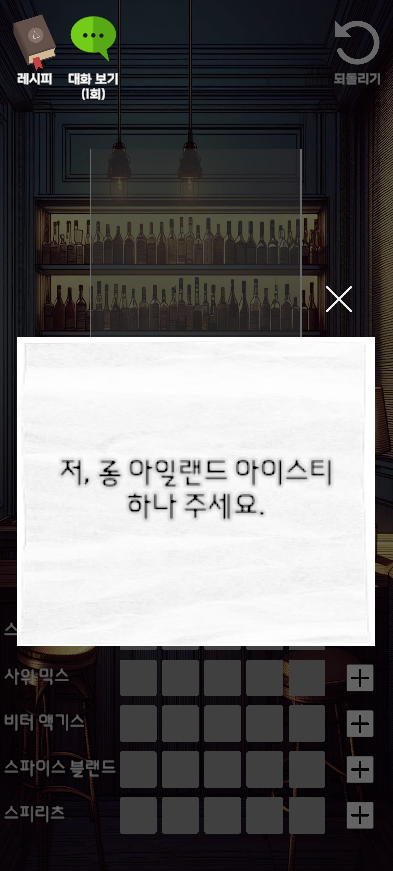
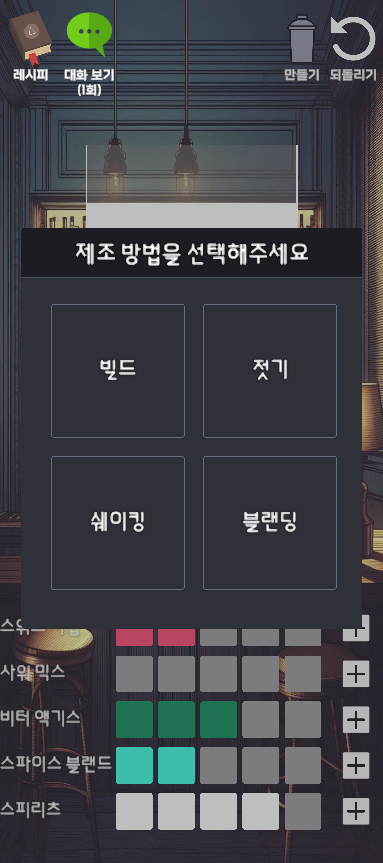

### WebGL 혹은 모바일apk로 게임을 실행합니다.

- 인트로 화면에서 아무 곳이나 클릭 혹은 터치합니다. 

- 메인 메뉴에서 스토리 모드로 진입합니다. 

- 하단의 텍스트 박스를 클릭 혹은 터치를 함으로써 게임을 진행할 수 있습니다. 

- 진행 중 플레이어의 이름을 입력을 받습니다. 

- 진행 중 칵테일 레시피를 소개합니다. 
- 드래그로 여러 종류의 칵테일을 확인할 수 있습니다. 
- 칵테일 레시피 확인이 끝나면 하단의 X 버튼을 누르거나 해당 ui 바깥을 눌러서 닫을 수 있습니다. 

- 진행 중 NPC가 요청하는 칵테일을 재료와 제조법에 맞게 제조해 줍니다.
- 화면 좌측 상단에는 칵테일 레시피를 확인할 수 있는 버튼과 어떤 요청을 했는지 각 요청별로 1회씩 확인할 수 있는 버튼이 있습니다.
- 화면 우측 상단에는 재료를 잘못 넣었을 경우 초기화할 수 있는 되돌리기 버튼과 일정 개수의 재료를 넣고 나면 활성화되는 만들기 버튼이 생성됩니다.
- 만들기 버튼을 누르고 나면 제조법을 선택하여 칵테일을 제조할 수 있게 됩니다. 

- 각 제조법에 따라 칵테일을 만들어줍니다.
- 빌드 제조법의 경우 바로 칵테일이 완성됩니다.
- 젓기 제조법의 경우 WebGL 환경에서는 바 스푼을 드래그하여 저어주고, 모바일 환경에서는 동일하게 터치하여 드래그해서 저어주거나 모바일 기기를 흔들어서 제조할 수 있습니다.
- 쉐이킹 제조법의 경우 젓기 제조법과 동일하게 쉐이커를 드래그해서 제조하거나 모바일 기기의 경우 흔들어서 제조할 수 있습니다.
- 블랜딩 제조법의 경우 화면 하단에 있는 블랜딩하기 버튼을 클릭 또는 터치하여 제조할 수 있습니다. 

- 제조가 완료되면 완성한 칵테일을 확인할 수 있습니다.
- 손님에게 주기 버튼으로 NPC에게 완성된 칵테일을 만들어 줍니다. 

- 1일차에 해당되는 모든 주문을 완료하고 나면 정산 화면이 나옵니다.
- 해당 화면에서 게임이 저장됩니다.
- Next Day 버튼을 눌러 다음 일차로 넘어갈 수 있습니다. 

- 화면 우측 상단의 톱니바퀴 모양의 설정 버튼을 눌러 음량을 조절이 가능합니다.
- 메인 메뉴로 가기 버튼을 눌러 메인 메뉴로 이동합니다. 

- 스토리 모드 버튼을 눌러 스토리 모드 데이터가 잘 저장된 것을 확인할 수 있습니다.
- 창을 닫고 아케이드 모드 버튼을 눌러 아케이드 모드로 이동합니다. 

 
- 아케이드 모드에서는 랜덤 한 NPC가 등장하여 주문을 합니다.
- 스토리 모드에서 진행한 것과 동일하게 요청사항에 맞게 칵테일을 만들어 주는 것이 목표입니다.
- 화면 상단의 타이머가 0초가 되거나 요청과 맞지 않는 잘못된 음료를 제작하는 경우 화면 우측 상단에 있는 하트가 깎이게 되고, 하트가 0개가 되면 아케이드 모드가 종료됩니다. 

- 아케이드 모드가 종료되면 랭킹을 등록할 수 있습니다. 

- 메인 메뉴의 랭킹에서 현재까지 등록된 Top 20명의 랭킹 목록을 확인할 수 있습니다. 

